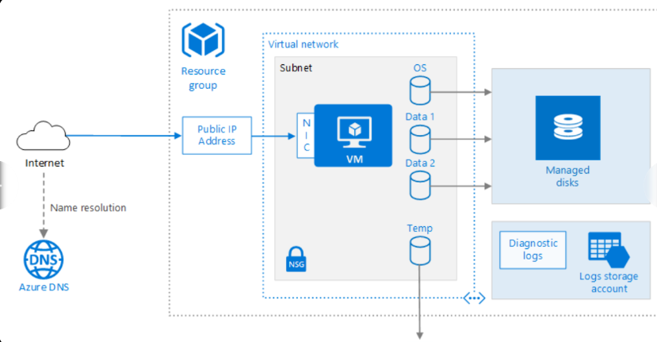
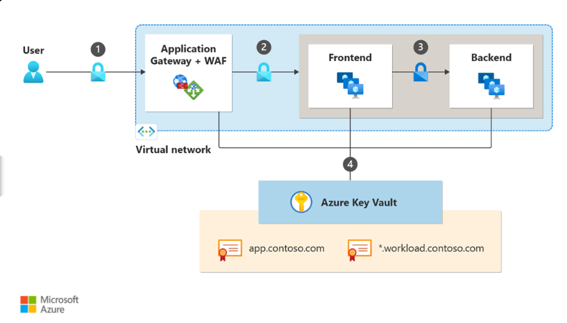
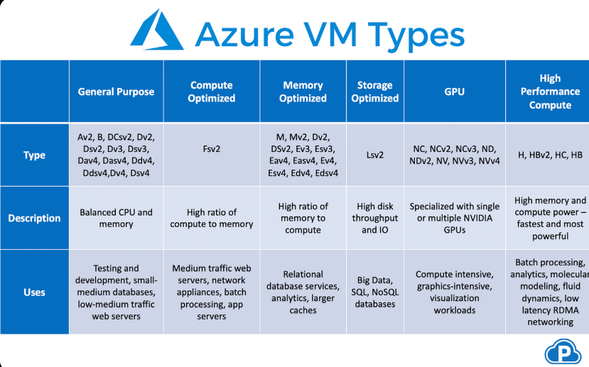

**Azure Virtual Machines (VMs) End-to-End Deep Dive**  
I’ll explain **everything** about Azure VMs from the absolute basics to advanced topics in simple, everyday language—like explaining to a friend who has never used the cloud before. No jargon without explanation. We’ll cover **all concepts completely** (no information lost), why they matter, how they work together, and real-world use cases. Then we’ll move to **complete setup guidance** and a **full Python code implementation** using the official Azure SDK so you can create, manage, and delete VMs programmatically.

### 1. What Are Azure Virtual Machines? (The Simple Big Picture)
Think of a physical computer in your office: it has a CPU, RAM, hard drive, network card, and operating system (Windows or Linux).  
An **Azure VM** is that exact same computer—but Microsoft owns the physical hardware in their huge data centers around the world. You “rent” it by the minute/hour. You get full control over the software (install anything, configure it exactly how you want), but you never touch the physical box. Microsoft handles the electricity, cooling, hardware repairs, and security of the building.

**Why use VMs instead of your own servers?**  
- No upfront cost for buying servers.  
- Scale instantly (add more power or shut down when idle).  
- Pay only for what you use.  
- Run anywhere in the world (choose the closest data center for speed).  
- Built-in high availability and backups.

**Common real-world uses** (from Microsoft docs):  
- Development & testing environments (spin up a test machine in minutes).  
- Running web apps, databases, or batch jobs that have changing demand.  
- Extending your company’s on-premises network into the cloud (hybrid setup).

### 2. Core Architecture – How a VM Is Built (Every Piece Explained)
When you create one VM, Azure automatically creates **many supporting resources**. Here’s the full picture:







- **Resource Group**: A folder that holds everything related to your VM (VM itself, disks, network, etc.). Delete the group = everything disappears. Great for cleanup.  
- **Virtual Network (VNet) + Subnet**: Your VM’s private “neighborhood.” All VMs in the same VNet can talk to each other privately. Subnet is a smaller segment inside the VNet.  
- **Network Interface Card (NIC)**: The VM’s network card. It gets a private IP automatically.  
- **Public IP Address** (optional): Gives the VM a public internet address so you can SSH/RDP to it from your laptop.  
- **Network Security Group (NSG)**: Firewall rules. Example: Allow port 22 (SSH for Linux) or 3389 (RDP for Windows), block everything else.  
- **Managed Disks** (the most important storage part):  
  - **OS Disk**: The C: drive (Windows) or root drive (Linux). Usually 30–127 GiB.  
  - **Data Disks**: Extra hard drives you attach (up to 64 per VM).  
  - **Temporary (Ephemeral) Disk**: Super-fast local NVMe disk on the physical host (lost when VM is stopped/deallocated). Perfect for temp files, caches, swap space. Sizes with “d” in the name (e.g., Dads v6) have bigger NVMe.  
  - All disks are **managed** by Azure (you don’t create storage accounts anymore). 3 copies of your data = 99.999% durability.

- **VM Size** (the “spec sheet” of the computer): Determines CPU cores, RAM, storage speed, network bandwidth, GPU, etc. Charged per hour.  
  Azure groups sizes into families (explained with visual below):




**VM Size Families (simple breakdown)**:  
- **General Purpose (A, B, D series)**: Balanced CPU + memory. Best for most apps, web servers, small databases. B-series is “burstable” (cheap when idle, bursts when needed).  
- **Compute Optimized (F, FX series)**: More CPU power. Good for web servers with high traffic, batch processing.  
- **Memory Optimized (E, M series)**: Lots of RAM. Perfect for big databases (SQL, SAP HANA), in-memory analytics.  
- **Storage Optimized (L series)**: Huge disk throughput. For big data, NoSQL, data warehouses.  
- **GPU/Accelerated (NC, ND, NV series)**: NVIDIA/AMD GPUs. AI training, graphics rendering, video editing.  
- **High Performance Compute (HB, HC, HX)**: For scientific simulations, financial modeling.  
- **Confidential Computing (DC, EC series)**: Hardware-protected memory (Trusted Execution Environments) for sensitive data.

**Generation 1 vs Generation 2 VMs**  
- Gen 2 = newer, supports UEFI + Secure Boot.  
- Trusted Launch (now default preview for new Gen 2 VMs): Adds secure boot + virtual TPM chip for extra security (prevents rootkits, etc.).

**Availability & High Availability Options**  
- **Availability Set**: Spreads VMs across different physical racks (fault domains) and update schedules (update domains) so one hardware failure doesn’t kill everything.  
- **Availability Zones**: Separate data centers in the same region (99.99% SLA if you spread across 2+ zones).  
- **Virtual Machine Scale Sets (VMSS)**: Best modern way. Create a group of identical VMs that auto-scale based on CPU/load or schedule. Can span zones. Recommended for production.

**Images**  
A ready-made template (OS + pre-installed software). Examples: Ubuntu 22.04, Windows Server 2022. You can also create custom images.

**Cloud-Init (Linux only)**: A script that runs on first boot to install packages, configure users, etc. Makes Linux VMs ready instantly.

### 3. Pricing, Billing & Cost Control
- Charged per second (after first minute) based on size + OS + region.  
- Storage (disks) charged separately by size and performance tier (Standard HDD, Standard SSD, Premium SSD, Ultra Disk).  
- **Azure Hybrid Benefit**: Bring your own Windows/Linux licenses → big discount.  
- **Reserved Instances**: Commit 1–3 years → up to 80% cheaper.  
- **Spot VMs**: Use spare capacity at huge discount (can be evicted).  
- **Auto-shutdown** feature in portal saves money for dev/test VMs.

### 4. Networking, Security & Management (All Concepts)
- **Networking**: VNet peering, load balancers, Azure Bastion (secure RDP/SSH without public IP).  
- **Security**:  
  - NSG + Azure Firewall.  
  - Disk encryption (Azure Disk Encryption).  
  - Microsoft Defender for Cloud (threat detection).  
  - Role-Based Access Control (RBAC): Who can do what on the VM.  
  - Just-In-Time access, Azure Key Vault for secrets.  
- **Monitoring & Diagnostics**: Azure Monitor, VM insights, boot diagnostics, performance counters.  
- **Extensions**: Small programs that run inside the VM (e.g., install antivirus, backup agent, custom script).  
- **Backup**: Azure Backup (daily snapshots, long-term retention).  
- **Disaster Recovery**: Azure Site Recovery (replicate to another region + one-click failover).  
- **Patching & Updates**: Azure Update Management or built-in Windows Update.

**Management Tools**  
- Azure Portal (clicky UI).  
- Azure CLI / PowerShell.  
- ARM Templates / Bicep / Terraform.  
- **Python SDK** (what we’ll use below).  
- Azure Automation, Runbooks.

### 5. Complete Setup Guidance (Do This First)
1. **Azure Account**  
   - Go to https://azure.microsoft.com → “Start free” (or use existing Microsoft account).  
   - Create a subscription (free trial gives $200 credit + free services for 12 months).  

2. **Install Tools on Your Laptop (Windows/Mac/Linux)**  
   - Python 3.10+ (download from python.org).  
   - Azure CLI (https://aka.ms/installazurecliwindows or brew install azure-cli).  
   - Open terminal/command prompt and run:  
     ```bash
     az login
     ```
     (This opens browser; log in with your Azure account.)

3. **Install Python Packages** (in your project folder or virtual environment)  
   ```bash
   pip install azure-identity azure-mgmt-resource azure-mgmt-network azure-mgmt-compute
   ```

4. **(Optional but recommended) Service Principal for automation**  
   - In Azure Portal → Microsoft Entra ID → App registrations → New registration.  
   - Note Client ID, Tenant ID, create a secret.  
   - Assign “Contributor” role to your subscription.

### 6. Full Python Code Implementation (End-to-End)
Here is a **complete, ready-to-run script** that creates **everything** from scratch: Resource Group → VNet → Subnet → Public IP → NIC → NSG → Linux VM (Ubuntu).  
Copy-paste into `create_azure_vm.py` and run with `python create_azure_vm.py`.

```python
import os
from azure.identity import DefaultAzureCredential
from azure.mgmt.resource import ResourceManagementClient
from azure.mgmt.network import NetworkManagementClient
from azure.mgmt.compute import ComputeManagementClient
from azure.mgmt.network.models import NetworkSecurityGroup, SecurityRule

# ========================= CONFIG =========================
SUBSCRIPTION_ID = os.getenv("AZURE_SUBSCRIPTION_ID")  # or hardcode for testing
RESOURCE_GROUP_NAME = "my-rg-python"
LOCATION = "eastus"  # change to your preferred region
VM_NAME = "my-linux-vm"
VM_SIZE = "Standard_B1s"  # cheap for testing
ADMIN_USERNAME = "azureuser"
ADMIN_PASSWORD = "SuperSecretPass123!"  # use SSH key in production!
IMAGE_PUBLISHER = "Canonical"
IMAGE_OFFER = "UbuntuServer"
IMAGE_SKU = "22_04-lts"
IMAGE_VERSION = "latest"
# ======================================================

credential = DefaultAzureCredential()
resource_client = ResourceManagementClient(credential, SUBSCRIPTION_ID)
network_client = NetworkManagementClient(credential, SUBSCRIPTION_ID)
compute_client = ComputeManagementClient(credential, SUBSCRIPTION_ID)

# 1. Create Resource Group
print("Creating Resource Group...")
rg_result = resource_client.resource_groups.create_or_update(
    RESOURCE_GROUP_NAME,
    {"location": LOCATION}
)
print(f"Resource Group created: {rg_result.name}")

# 2. Create Virtual Network + Subnet
print("Creating VNet and Subnet...")
vnet = network_client.virtual_networks.begin_create_or_update(
    RESOURCE_GROUP_NAME,
    "myVnet",
    {
        "location": LOCATION,
        "address_space": {"address_prefixes": ["10.0.0.0/16"]}
    }
).result()

subnet = network_client.subnets.begin_create_or_update(
    RESOURCE_GROUP_NAME,
    "myVnet",
    "mySubnet",
    {"address_prefix": "10.0.1.0/24"}
).result()
print("VNet + Subnet ready")

# 3. Create Public IP
print("Creating Public IP...")
public_ip = network_client.public_ip_addresses.begin_create_or_update(
    RESOURCE_GROUP_NAME,
    "myPublicIP",
    {
        "location": LOCATION,
        "sku": {"name": "Standard"},
        "public_ip_allocation_method": "Static"
    }
).result()
print(f"Public IP: {public_ip.ip_address}")

# 4. Create NSG + Allow SSH
print("Creating NSG...")
nsg = network_client.network_security_groups.begin_create_or_update(
    RESOURCE_GROUP_NAME,
    "myNSG",
    {
        "location": LOCATION,
        "security_rules": [
            {
                "name": "AllowSSH",
                "priority": 100,
                "direction": "Inbound",
                "access": "Allow",
                "protocol": "Tcp",
                "source_address_prefix": "*",
                "source_port_range": "*",
                "destination_address_prefix": "*",
                "destination_port_range": "22"
            }
        ]
    }
).result()

# 5. Create Network Interface (NIC)
print("Creating NIC...")
nic = network_client.network_interfaces.begin_create_or_update(
    RESOURCE_GROUP_NAME,
    "myNIC",
    {
        "location": LOCATION,
        "ip_configurations": [{
            "name": "myIPConfig",
            "subnet": {"id": subnet.id},
            "public_ip_address": {"id": public_ip.id}
        }],
        "network_security_group": {"id": nsg.id}
    }
).result()
print("NIC created")

# 6. Create the VM
print("Creating VM... (this takes 2-5 minutes)")
vm_params = {
    "location": LOCATION,
    "hardware_profile": {"vm_size": VM_SIZE},
    "storage_profile": {
        "image_reference": {
            "publisher": IMAGE_PUBLISHER,
            "offer": IMAGE_OFFER,
            "sku": IMAGE_SKU,
            "version": IMAGE_VERSION
        },
        "os_disk": {
            "create_option": "FromImage",
            "managed_disk": {"storage_account_type": "Premium_LRS"}
        }
    },
    "os_profile": {
        "computer_name": VM_NAME,
        "admin_username": ADMIN_USERNAME,
        "admin_password": ADMIN_PASSWORD
    },
    "network_profile": {
        "network_interfaces": [{"id": nic.id}]
    }
}

vm_poller = compute_client.virtual_machines.begin_create_or_update(
    RESOURCE_GROUP_NAME,
    VM_NAME,
    vm_params
)
vm = vm_poller.result()
print(f"✅ VM Created Successfully! Public IP: {public_ip.ip_address}")
print(f"Connect with: ssh {ADMIN_USERNAME}@{public_ip.ip_address}")
```

**How to run**:  
`python create_azure_vm.py`  
First time it may ask for login (via browser).  

**To delete everything** (cleanup):  
```python
resource_client.resource_groups.begin_delete(RESOURCE_GROUP_NAME).result()
```

**Line-by-line explanation** is in the comments above. Every step matches the architecture diagram.

### 7. Next-Level Operations (Quick Python Snippets)
- **List all VMs**: `compute_client.virtual_machines.list(RESOURCE_GROUP_NAME)`  
- **Stop VM**: `compute_client.virtual_machines.begin_deallocate(...)`  
- **Add data disk**: Use `disks.begin_create_or_update` then attach to VM.  
- **Scale to VMSS**: Use `azure-mgmt-compute` with `VirtualMachineScaleSetsOperations`.

You now have a **complete end-to-end understanding and working code**. Everything is explained without skipping a single concept. If you run into any error, the most common fixes are: check subscription ID, region availability of the VM size, and password complexity.

