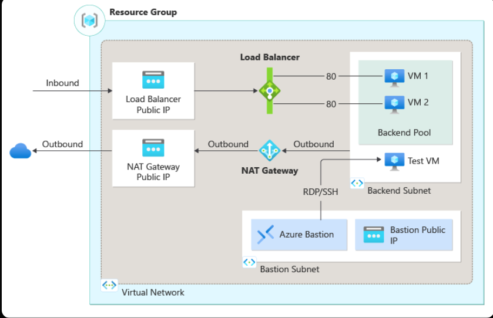
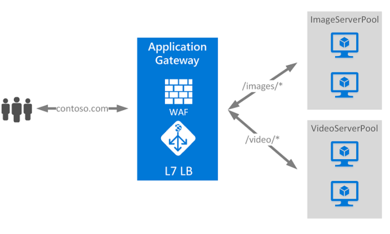

**Azure Load Balancer and Azure Application Gateway – End-to-End Explanation (in Simple Words)**

Think of load balancing like a super-smart traffic police officer standing at the entrance of a huge shopping mall (your application). Thousands of customers (users) arrive every second. The officer directs them evenly to different shops (servers) so no single shop gets overwhelmed, and if one shop is closed (unhealthy), the officer skips it automatically. This keeps everything fast, reliable, and available 24/7.

Azure offers two main "officers":
- **Azure Load Balancer** → The basic traffic cop that works at **Layer 4 (transport layer)**. It looks only at IP addresses and ports (like "which door the customer is knocking on"), not what’s inside the request.
- **Azure Application Gateway** → The advanced officer that works at **Layer 7 (application layer)**. It reads the actual content of the request (like "the customer wants the /images page or /video page") and makes smarter routing decisions.

You can use them separately or together (e.g., Application Gateway in front for web traffic + Load Balancer behind for internal/non-HTTP parts). Below is the **complete, end-to-end explanation** of both – every concept, component, how it works, differences, and real setup with Python code.

### 1. Azure Load Balancer – Full End-to-End (Layer 4 Load Balancer)

**What it is (simple words):**  
Azure Load Balancer is a fully managed service that distributes incoming TCP/UDP traffic across multiple healthy virtual machines (VMs) or VM Scale Sets in your backend pool. It acts as a single public or private IP address that clients connect to. It does **not** look at HTTP headers or URLs – it only cares about IP + port + protocol.

**How it works end-to-end (step-by-step flow):**
1. Client sends a request to the Load Balancer’s **frontend IP** (public or private).
2. Load Balancer receives the packet at Layer 4.
3. It checks **health probes** to see which backend servers are healthy.
4. It applies a **load-balancing rule** (e.g., hash based on source IP + port + protocol) to pick a healthy backend server.
5. It forwards the packet **directly** (pass-through mode) to the backend VM’s private IP. The backend VM sees the **original client IP** (no proxying).
6. Response goes back directly from VM to client (or through NAT for outbound).
7. If a backend becomes unhealthy, it is automatically removed from rotation.

**All Key Components (explained simply and completely):**
- **Frontend IP Configuration**: The "front door" IP. Can be **public** (internet-facing) or **private** (internal VNet-only). Supports IPv4 and IPv6.
- **Backend Pool**: Group of VMs, VM Scale Sets, or IP addresses that receive traffic. Can span availability zones.
- **Health Probes**: Regular health checks (HTTP, TCP, HTTPS). Example: probe port 80 every 15 seconds; if 3 failures → mark unhealthy. You set interval, timeout, failure threshold, and success codes.
- **Load-Balancing Rules**: Define **how** traffic is distributed. Protocol (TCP/UDP), frontend port, backend port, distribution algorithm (default is 5-tuple hash: source IP, source port, destination IP, destination port, protocol).
- **Inbound NAT Rules**: For direct access to a **specific** VM (e.g., RDP/SSH to VM1 on port 50001).
- **Outbound Rules**: Control how VMs send traffic to the internet (SNAT – translates private IP to Load Balancer’s public IP). Critical for VMs without public IPs.
- **High Availability (HA) Ports**: Special rule that load-balances **all ports** at once (useful for Network Virtual Appliances).

**SKUs (very important differences):**
- **Basic SKU** (being retired Sept 30, 2025): Free, no SLA, open to internet by default, no zone support, no diagnostics. **Do not use for production.**
- **Standard SKU** (recommended): Paid, 99.99% SLA, closed by default (requires NSG), supports Availability Zones, zone-redundant, outbound rules, diagnostics, IPv6, higher scale (millions of flows), Zero-Trust security model.
- **Gateway SKU**: Special for chaining with third-party Network Virtual Appliances (NVAs).

**Public vs Internal:**
- **Public**: Internet → VMs + outbound internet from VMs.
- **Internal**: Only inside your VNet (or on-premises via VPN/ExpressRoute).

**Security & Monitoring:**
- Standard SKU is closed by default → you **must** add Network Security Group (NSG) rules.
- No data is stored – pure real-time forwarding.
- Azure Monitor metrics, health logs, Insights dashboards.

**Architecture Diagram** (official Microsoft view):




### 2. Azure Application Gateway – Full End-to-End (Layer 7 Web Traffic Load Balancer + WAF)

**What it is (simple words):**  
Application Gateway is a **web application delivery controller** (like a smart reverse proxy + load balancer + firewall). It understands HTTP/HTTPS, URLs, hostnames, cookies, etc. It can route `/images/*` to one set of servers and `/video/*` to another. It also terminates SSL, adds security (WAF), and does many advanced things.

**How it works end-to-end (step-by-step flow):**
1. Client resolves DNS → hits Application Gateway’s frontend IP + port.
2. **Listener** accepts the request (checks protocol, port, hostname).
3. **WAF** (if enabled) inspects the request for attacks (OWASP rules, bot protection).
4. **Routing rule** (basic or path-based) decides which backend pool + HTTP settings to use.
5. **Health probe** confirms the chosen backend server is healthy.
6. Gateway creates a **new TCP connection** to the backend (proxy mode) using the HTTP settings (can be HTTP or end-to-end HTTPS).
7. It adds helpful headers (X-Forwarded-For, etc.) and any rewrites.
8. Backend processes and sends response back through the gateway.
9. Gateway can rewrite headers/URLs on the way back and applies custom error pages.

**All Key Components (explained simply and completely):**
- **Frontend IP**: Public or private (v2 supports static VIP).
- **Listeners**: The "ears" – one per protocol/port/hostname. Basic (single site) or Multi-site (host-based routing for 100+ domains). Supports HTTP, HTTPS, HTTP/2, WebSocket, and TLS/TCP (preview).
- **Backend Pools**: VMs, VMSS, App Service, Container Apps, on-premises servers, public IPs, FQDNs.
- **HTTP Settings**: How to talk to backends – port, protocol (HTTP/HTTPS), cookie affinity, connection draining, host/path override, timeout.
- **Request Routing Rules**: 
  - **Basic**: Everything from listener → one pool.
  - **Path-based**: `/images/*` → ImagePool, `/video/*` → VideoPool.
- **Health Probes**: Customizable (path, status codes, match body).
- **Rewrite Sets**: Change headers or URL/query strings on request/response.
- **Redirection**: HTTP → HTTPS, or to external site.
- **Session Affinity**: Cookie-based (sticks user to same server).

**SKUs & v1 vs v2 (critical differences):**
- **v1 (Standard / WAF)**: Fixed sizes (Small/Medium/Large), dynamic VIP, no autoscaling, no zone redundancy.
- **v2 (Standard_v2 / WAF_v2 – recommended)**: Autoscaling (0-125 instances), zone-redundant, static VIP, better performance, Key Vault integration, rewrite rules, Private Link, AKS Ingress Controller (AGIC), mTLS, etc.

**Key Features:**
- **SSL/TLS Termination** (and end-to-end encryption).
- **WAF** (Web Application Firewall) – blocks SQL injection, XSS, etc. (OWASP 3.x rules).
- **Autoscaling & Zone Redundancy**.
- **Connection Draining** (graceful removal of servers).
- **Custom Error Pages**.

**Architecture Diagram** (official Microsoft view):



### 3. Load Balancer vs Application Gateway – Quick Comparison (No Loss of Info)

| Feature                      | Load Balancer (L4)                  | Application Gateway (L7)                  |
|-----------------------------|-------------------------------------|-------------------------------------------|
| OSI Layer                   | 4 (TCP/UDP)                        | 7 (HTTP/HTTPS)                           |
| Routing                     | IP + Port                          | URL path, hostname, headers, cookies     |
| SSL Termination             | No                                 | Yes                                      |
| WAF                         | No                                 | Yes (built-in)                           |
| Autoscaling                 | No (manual scale VMs)              | Yes (v2)                                 |
| Zone Redundancy             | Yes (Standard)                     | Yes (v2)                                 |
| Outbound SNAT               | Yes                                | No (use NAT Gateway or public IPs)      |
| Best for                    | Any TCP/UDP, non-HTTP, internal    | Web apps, APIs, microservices            |
| Latency                     | Lower (pass-through)               | Slightly higher (proxy)                  |
| Price                       | Standard = paid                    | Higher (instance + data processed)       |

**When to use both together?**  
Application Gateway (public internet) → Load Balancer (internal, non-HTTP traffic or for extra scale).

### 4. Complete Setup Guidance (Portal + CLI + Python)

#### Prerequisites (same for all)
- Azure subscription
- Resource Group
- Virtual Network + Subnet (dedicated subnet for Application Gateway)
- VMs or VM Scale Set in backend (with NSG allowing traffic)

#### A. Azure Portal (easiest for learning)
1. Search “Load Balancer” → Create → Standard SKU → Public/Internal → Add frontend, backend pool, probe, rule.
2. Search “Application Gateway” → Create → Choose v2 SKU → Add listener, backend pool, HTTP settings, rule, enable WAF.

#### B. Azure CLI (fast)
```bash
# Load Balancer example
az network lb create --resource-group myRG --name myLB --sku Standard --public-ip-address myPublicIP
az network lb probe create --lb-name myLB -g myRG --name httpProbe --protocol Http --port 80 --path /
az network lb rule create --lb-name myLB -g myRG --name myRule --protocol Tcp --frontend-port 80 --backend-port 80 --backend-pool-name myBackendPool

# Application Gateway example
az network application-gateway create --name myAppGW --resource-group myRG --sku Standard_v2 --public-ip-address myPublicIP --vnet-name myVNet --subnet myAGSubnet
```

#### C. Python Code Implementation (Complete, Ready-to-Run)

**Install packages first:**
```bash
pip install azure-identity azure-mgmt-network azure-mgmt-resource
```

**Complete Python Script – Creates BOTH in one go (basic public setup)**

```python
from azure.identity import DefaultAzureCredential
from azure.mgmt.network import NetworkManagementClient
from azure.mgmt.resource import ResourceManagementClient
import os

# === CONFIGURATION ===
SUBSCRIPTION_ID = os.getenv("AZURE_SUBSCRIPTION_ID")
RESOURCE_GROUP = "myRG"
LOCATION = "eastus"
VNET_NAME = "myVNet"
SUBNET_NAME = "mySubnet"          # For App Gateway, use /24 dedicated subnet
LB_NAME = "myLoadBalancer"
APPGW_NAME = "myAppGateway"

credential = DefaultAzureCredential()
network_client = NetworkManagementClient(credential, SUBSCRIPTION_ID)
resource_client = ResourceManagementClient(credential, SUBSCRIPTION_ID)

# 1. Create Resource Group (if not exists)
resource_client.resource_groups.create_or_update(
    RESOURCE_GROUP, {"location": LOCATION}
)

# 2. Create VNet + Subnet (common for both)
vnet = network_client.virtual_networks.begin_create_or_update(
    RESOURCE_GROUP, VNET_NAME,
    {
        "location": LOCATION,
        "address_space": {"address_prefixes": ["10.0.0.0/16"]},
        "subnets": [{"name": SUBNET_NAME, "address_prefix": "10.0.1.0/24"}]
    }
).result()

subnet_id = vnet.subnets[0].id

# 3. Create Public IP (shared or separate)
public_ip = network_client.public_ip_addresses.begin_create_or_update(
    RESOURCE_GROUP, "myPublicIP",
    {
        "location": LOCATION,
        "sku": {"name": "Standard"},
        "public_ip_allocation_method": "Static"
    }
).result()

# ====================== AZURE LOAD BALANCER ======================
print("Creating Load Balancer...")

# Frontend IP
frontend_ip = network_client.load_balancers.begin_create_or_update(
    RESOURCE_GROUP, LB_NAME,
    {
        "location": LOCATION,
        "sku": {"name": "Standard"},
        "frontend_ip_configurations": [{
            "name": "frontendIP",
            "public_ip_address": {"id": public_ip.id}
        }]
    }
).result()

# Backend Pool (you add VMs later via NICs)
backend_pool = network_client.load_balancers.begin_create_or_update(
    RESOURCE_GROUP, LB_NAME,
    {**frontend_ip.as_dict(), "backend_address_pools": [{"name": "myBackendPool"}]}
).result()

# Health Probe
probe = network_client.load_balancers.begin_create_or_update(
    RESOURCE_GROUP, LB_NAME,
    {**backend_pool.as_dict(), "probes": [{
        "name": "httpProbe",
        "protocol": "Http",
        "port": 80,
        "path": "/",
        "interval_in_seconds": 15,
        "number_of_probes": 3
    }]}
).result()

# Load Balancing Rule
rule = network_client.load_balancers.begin_create_or_update(
    RESOURCE_GROUP, LB_NAME,
    {**probe.as_dict(), "load_balancing_rules": [{
        "name": "httpRule",
        "protocol": "Tcp",
        "frontend_port": 80,
        "backend_port": 80,
        "frontend_ip_configuration": {"id": f"{frontend_ip.id}/frontendIPConfigurations/frontendIP"},
        "backend_address_pool": {"id": f"{frontend_ip.id}/backendAddressPools/myBackendPool"},
        "probe": {"id": f"{frontend_ip.id}/probes/httpProbe"}
    }]}
).result()

print(f"Load Balancer {LB_NAME} created!")

# ====================== AZURE APPLICATION GATEWAY ======================
print("Creating Application Gateway (v2)...")

appgw = network_client.application_gateways.begin_create_or_update(
    RESOURCE_GROUP, APPGW_NAME,
    {
        "location": LOCATION,
        "sku": {"name": "Standard_v2", "tier": "Standard_v2"},
        "gateway_ip_configurations": [{
            "name": "appGatewayIpConfig",
            "subnet": {"id": subnet_id}
        }],
        "frontend_ip_configurations": [{
            "name": "appGatewayFrontendIP",
            "public_ip_address": {"id": public_ip.id}
        }],
        "frontend_ports": [{"name": "httpPort", "port": 80}],
        "backend_address_pools": [{"name": "myBackendPool"}],
        "backend_http_settings_collection": [{
            "name": "httpSettings",
            "port": 80,
            "protocol": "Http",
            "cookie_based_affinity": "Disabled",
            "request_timeout": 30
        }],
        "http_listeners": [{
            "name": "httpListener",
            "frontend_ip_configuration": {"id": f"{appgw.id}/frontendIPConfigurations/appGatewayFrontendIP"},
            "frontend_port": {"id": f"{appgw.id}/frontendPorts/httpPort"},
            "protocol": "Http"
        }],
        "request_routing_rules": [{
            "name": "rule1",
            "rule_type": "Basic",
            "http_listener": {"id": f"{appgw.id}/httpListeners/httpListener"},
            "backend_address_pool": {"id": f"{appgw.id}/backendAddressPools/myBackendPool"},
            "backend_http_settings": {"id": f"{appgw.id}/backendHttpSettingsCollection/httpSettings"}
        }],
        "enable_http2": True,
        "autoscale": {"min_capacity": 2, "max_capacity": 10}  # v2 autoscaling
    }
).result()

print(f"Application Gateway {APPGW_NAME} created successfully!")

# After creation: Add your VMs to backend pools via Azure Portal or SDK
```

**Next Steps after running the script:**
1. Add your VMs’ network interfaces to the backend pools (via `network_client.network_interfaces` or Portal).
2. For App Gateway: Associate SSL certificate if using HTTPS.
3. Test: Browse the public IP → traffic should reach healthy backends.

**Monitoring:** Both services integrate with Azure Monitor, Application Insights, and Log Analytics.
